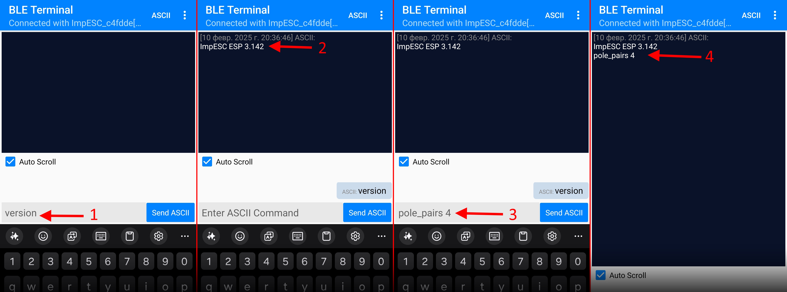

# 3 Настройка контроллера

Настройку контроллера осуществляется по **Bluetooth**. Для настройки необходим телефон на Android или ПК на Windows 10/11 с поддержкой Bluetooth 4.0 и выше со стандартом Bluetooth Low Energy.  
Приложение для настройки под разные системы описаны в разделе [приложений](9-soft).
## Команды

Взаимодействие с контроллером осуществляется за счёт отправки текстовых команд и значений через BLE терминал. Так, например, что бы узнать версию прошивки нужно ввести команду `version`,  в ответ придёт версия прошивки `Version 3.144`.  
Что бы записать значение, нужно после команды через пробел добавить значение. Например, команда `pole_pairs 4` установит количество пар полюсов магнитов мотора равным 4. В случаи корректно введённой команды, в ответ придёт подтверждение с текущем значением числа пар полюсов.  Если же в команде `pole_pairs` не указывать значение, в ответ придёт текущее значение данной переменной.
Если команда была введена с ошибкой, в ответ придёт сообщение `wrong command`.  
При изменении параметра, он сразу применяется, но после выключения он не сохраниться. Для сохранения используется команда `save`.
Список всех доступных команд доступен в разделе [Команды](7-commands.md).

## Первое включение
После прохождения всех проводов к контроллеру необходимо провести настройку.  
Первичная настройка состоит из следующих этапов:
- [Настройка мотора](4-motor.md)
- [Настройка ручки газа](5-trottle.md)
- [Настройка ограничений тока](6-limits.md)

После прохождения всех этапов настройки, параметры необходимо сохранить и перезапустить контроллер.  
### Дополнительная оптимизация
Во время первой поездки, в течении 10минут контроллер оптимизирует свои параметры. Если результат работы вас устроит, нужно будет произвести повторное сохранение. Если настройки оптимизации не сохранить, то после выключения питания они сбросятся и при следующем включении первые минуты поездки контроллер будет оптимизировать свои параметры заново.

## Сохранение параметров
Для сохранения текущих параметров необходимо ввести команду `save`, после чего необходимо перезапустить контроллер ключом зажигания.  
Что бы сбросить контроллер к заводским настройкам необходимо ввести команду `save_clear`.

